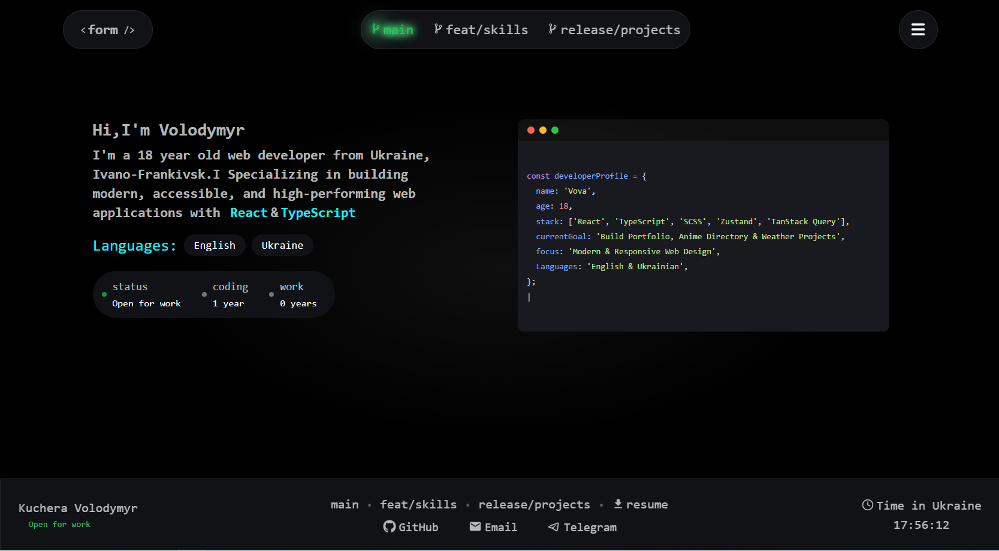
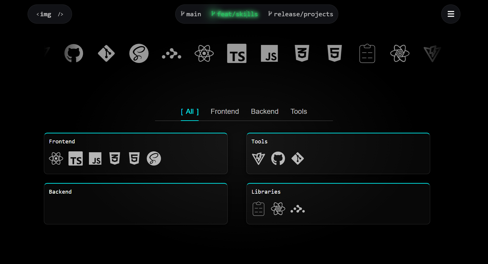
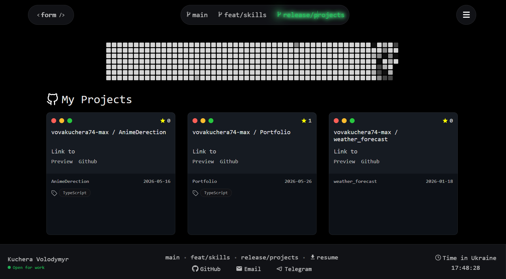

# 💼 Портфоліо — Кучера Володимир

Особисте портфоліо розробника побудоване на React & TypeScript. Термінальний UI з живою інтеграцією GitHub.



---

## 📸 Сторінки

### Головна
> Знайомство, профіль розробника у вигляді коду, статус і досвід


### Навички
> Прокручуваний банер з іконками технологій, картки з фільтрацією по категоріях (Frontend / Backend / Tools / Libraries)



### Проекти
> Живий граф контриб'юшнів з GitHub API + картки репозиторіїв із зірками, тегами мов і посиланнями



---

## 🛠 Технології

| Категорія | Технології |
|---|---|
| Основа | React, TypeScript |
| Стилі | SCSS Modules |
| Дані | TanStack Query (React Query) |
| Іконки | React Icons, Lucide React |
| Збірка | Vite |
| Деплой | Vercel _(незабаром)_ |

---

## 🚀 Запуск

```bash
# Клонуй репо
git clone https://github.com/vovakuchera74-max/Portfolio.git

# Встанови залежності
npm install

# перейти на вкладку Portfolio
cd Portfolio

# Запусти dev сервер
npm run dev
```

---

## 🌐 Живий сайт

> Незабаром на Vercel

---

## 📬 Контакти

- **GitHub** — [vovakuchera74-max](https://github.com/vovakuchera74-max)
- **Telegram** — [Darkdszxc](https://t.me/Darkdszxc)
- **Email** — vovakuchera74@gmail.com